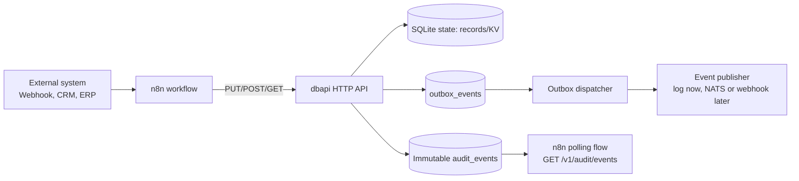
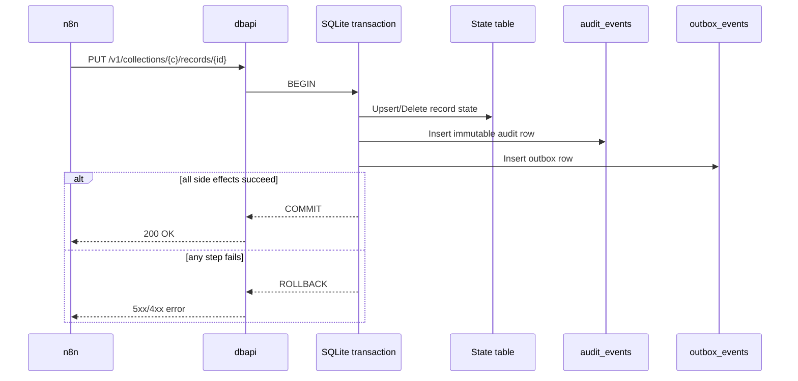
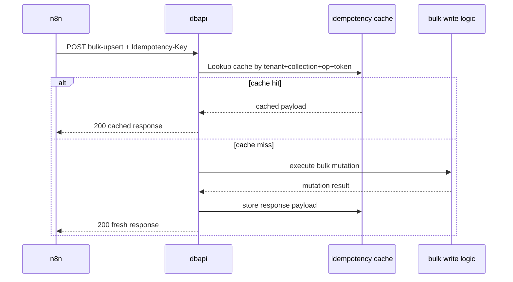
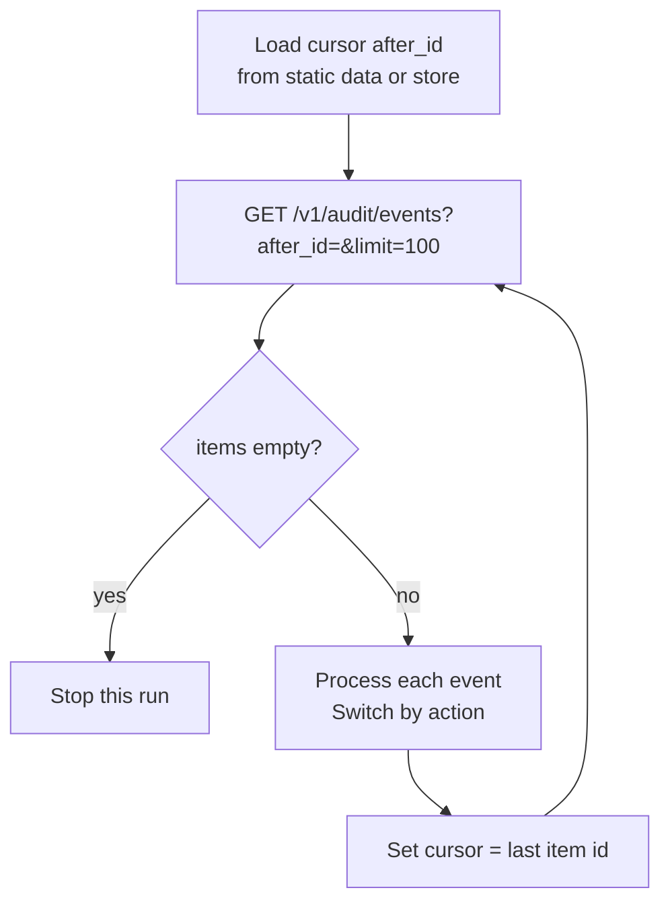
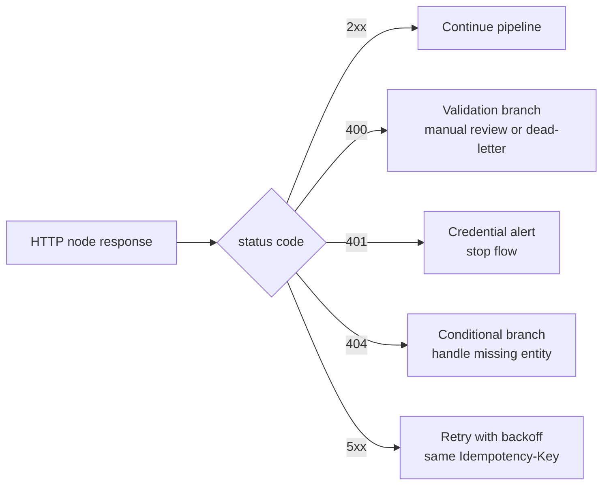
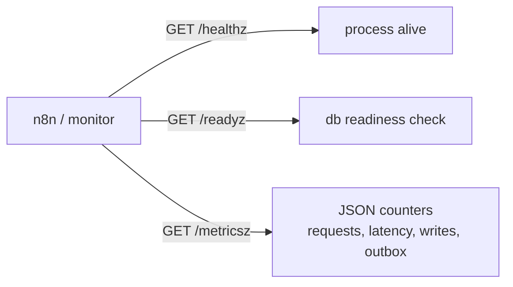

# Using dbapi with n8n

This guide shows how to use this API as:

- a durable JSON backend for automations,
- a lightweight CRM/business storage layer,
- a source/target for n8n workflows.

The examples are written for practical, production-minded usage.

---

## 1. What you get from this API

This service gives you two storage styles:

1. Raw KV API (low-level):
   - `PUT /v1/kv/{key}`
   - `GET /v1/kv/{key}`
   - `DELETE /v1/kv/{key}`
   - `GET /v1/kv?...` (prefix/category scan)

2. Collection Record API (recommended for n8n/business data):
   - `PUT /v1/collections/{collection}/records/{id}`
   - `GET /v1/collections/{collection}/records/{id}`
   - `DELETE /v1/collections/{collection}/records/{id}`
   - `GET /v1/collections/{collection}/records?prefix=&after=&limit=`
   - JSON-path filter query params for list:
     - `json_path=customer.email`
     - `json_op=eq|ne|contains|exists`
     - `json_value=...` (required for `eq|ne|contains`)
   - `POST /v1/collections/{collection}/records:bulk-upsert`
   - `POST /v1/collections/{collection}/records:bulk-delete`

3. Audit API (event-ready hybrid read side):
   - `GET /v1/audit/events?aggregate_type=&aggregate_id=&action=&after_id=&limit=`

All authenticated routes are tenant-scoped by API key.

---

## 2. Start dbapi for n8n

Run locally:

```bash
go run ./cmd/app \
  --addr :8080 \
  --db-path ./dbapi.sqlite \
  --bootstrap-api-key "n8n-dev-key" \
  --bootstrap-tenant "tenant-dev" \
  --bootstrap-key-name "n8n-local"
```

This creates/updates an API key at startup so n8n can connect immediately.

Alternative via env vars:

```bash
export DBAPI_BOOTSTRAP_API_KEY="n8n-dev-key"
export DBAPI_BOOTSTRAP_TENANT="tenant-dev"
export DBAPI_BOOTSTRAP_KEY_NAME="n8n-local"
go run ./cmd/app --addr :8080 --db-path ./dbapi.sqlite
```

Health check:

```bash
curl http://localhost:8080/healthz
```

OpenAPI metadata:

```bash
curl http://localhost:8080/openapi.json
```

---

## 3. n8n credentials setup

In n8n, create one reusable credential for this API:

1. Add node: **HTTP Request**.
2. Set method: `GET`.
3. URL: `http://localhost:8080/healthz`.
4. In Headers, add:
   - `X-API-Key: n8n-dev-key`
5. Save this as a reusable credential pattern in your workflow template.

Recommended standard headers for all dbapi calls:

- `X-API-Key: <your-key>`
- `Content-Type: application/json` (for request body endpoints)
- `Idempotency-Key: <stable-uuid-or-expression>` for bulk write/delete endpoints

You can also use `Authorization: Bearer <token>` if preferred.

---

## 4. Data modeling for CRM/business usage

Use one collection per domain entity, for example:

- `contacts`
- `companies`
- `deals`
- `tasks`
- `invoices`

Use deterministic IDs whenever possible:

- external source id (`hubspot_123`)
- email hash (`contact_...`)
- your internal UUID

This makes upserts naturally idempotent and easy to reason about in automation flows.

Example record body for `contacts`:

```json
{
  "first_name": "Ada",
  "last_name": "Lovelace",
  "email": "ada@example.com",
  "phone": "+37060000000",
  "status": "lead",
  "owner": "sales-team-1",
  "tags": ["vip", "conference-2026"],
  "meta": {
    "source": "n8n",
    "campaign": "spring-2026"
  }
}
```

---

## 5. Core n8n workflow patterns

### Pattern A: Webhook -> Normalize -> Upsert Contact

Use this for incoming form submissions, chatbot leads, or external webhook events.

Nodes:

1. **Webhook** (trigger)
2. **Set** or **Code** (normalize payload shape)
3. **HTTP Request** (Upsert record)

HTTP Request config:

- Method: `PUT`
- URL: `http://localhost:8080/v1/collections/contacts/records/{{$json.contact_id}}`
- Headers:
  - `X-API-Key: n8n-dev-key`
  - `Content-Type: application/json`
- Body: JSON from normalized node

Why this works well:

- Upsert prevents duplicate-creation race conditions.
- Deterministic ID means retries are safe.
- Tenant scoping is enforced server-side.

---

### Pattern B: Nightly Sync -> Bulk Upsert

Use for daily imports from ERP/CRM/export files.

Nodes:

1. **Cron**
2. Source nodes (Google Sheets, PostgreSQL, API, S3, etc.)
3. **Item Lists / Code** to transform into array of `{id, data}`
4. **HTTP Request** to bulk upsert

Bulk upsert request:

- Method: `POST`
- URL: `http://localhost:8080/v1/collections/contacts/records:bulk-upsert`
- Headers:
  - `X-API-Key: n8n-dev-key`
  - `Content-Type: application/json`
  - `Idempotency-Key: {{$workflow.id}}-{{$execution.id}}-contacts-sync`
- Body:

```json
{
  "items": [
    {
      "id": "contact_1",
      "data": {
        "email": "a@example.com",
        "status": "active"
      }
    },
    {
      "id": "contact_2",
      "data": {
        "email": "b@example.com",
        "status": "inactive"
      }
    }
  ]
}
```

Idempotency behavior:

- If n8n retries with the same `Idempotency-Key`, dbapi returns the cached result instead of reapplying.
- This is critical for robust automation under network or timeout retries.

---

### Pattern C: Batch Cleanup -> Bulk Delete

Use for stale records, completed jobs, archived leads.

Request:

- Method: `POST`
- URL: `http://localhost:8080/v1/collections/tasks/records:bulk-delete`
- Headers:
  - `X-API-Key: n8n-dev-key`
  - `Content-Type: application/json`
  - `Idempotency-Key: {{$workflow.id}}-{{$execution.id}}-task-cleanup`
- Body:

```json
{
  "ids": ["task_1001", "task_1002", "task_1003"]
}
```

---

### Pattern D: Paginated Read Loop (prefix + cursor)

Use to process large collections safely.

Endpoint:

`GET /v1/collections/{collection}/records?prefix=...&after=...&limit=...`

Typical loop strategy in n8n:

1. Initialize `after = ""`.
2. Fetch with `limit=100`.
3. Process returned items.
4. Set `after` to last item ID.
5. Repeat until response `items` is empty.

Why this is better than huge reads:

- predictable memory usage,
- restart-friendly,
- easier to monitor partial progress.

---

## 6. Practical curl examples (for debugging n8n issues)

Upsert one company:

```bash
curl -X PUT "http://localhost:8080/v1/collections/companies/records/company_42" \
  -H "X-API-Key: n8n-dev-key" \
  -H "Content-Type: application/json" \
  -d '{"name":"Acme","industry":"manufacturing"}'
```

Get one company:

```bash
curl "http://localhost:8080/v1/collections/companies/records/company_42" \
  -H "X-API-Key: n8n-dev-key"
```

List contacts (prefix scan):

```bash
curl "http://localhost:8080/v1/collections/contacts/records?prefix=eu_&limit=50" \
  -H "X-API-Key: n8n-dev-key"
```

List contacts by nested JSON path (`customer.email`):

```bash
curl "http://localhost:8080/v1/collections/contacts/records?json_path=customer.email&json_op=eq&json_value=ada@example.com" \
  -H "X-API-Key: n8n-dev-key"
```

Bulk upsert deals:

```bash
curl -X POST "http://localhost:8080/v1/collections/deals/records:bulk-upsert" \
  -H "X-API-Key: n8n-dev-key" \
  -H "Content-Type: application/json" \
  -H "Idempotency-Key: demo-deals-001" \
  -d '{"items":[{"id":"deal_1","data":{"value":1200,"stage":"new"}}]}'
```

---

## 7. Error handling in n8n (recommended)

For each HTTP node:

- Enable response capture.
- Branch on status codes:
  - `2xx`: continue
  - `400`: payload or validation bug (send to dead-letter or manual review)
  - `401`: auth misconfiguration (alert immediately)
  - `404`: expected in some lookup paths
  - `500`: transient or backend issue (retry with exponential backoff)

Recommended retry policy:

- max retries: 3-5
- backoff: exponential with jitter
- keep same `Idempotency-Key` on retry for bulk operations

---

## 8. Multi-tenant strategy with n8n

If you serve multiple customers/teams:

- issue one API key per tenant,
- run separate workflows per tenant or route by credential,
- never mix tenant credentials in same workflow branch unless explicitly intended.

Because tenant is derived from API key, the same collection name is safely namespaced by tenant.

---

## 9. Suggested collection conventions

For consistent automation and analytics:

- Use lowercase collection names: `contacts`, `deals`, `tasks`.
- Keep record IDs stable and URL-safe.
- Put external references under `data.external`:

```json
{
  "external": {
    "source": "hubspot",
    "id": "12345"
  }
}
```

- Keep `updated_at` logic in your workflow payload semantics (for conflict decisions).

---

## 10. Security and operations checklist

Before production usage:

1. Put dbapi behind HTTPS (reverse proxy, ingress, or API gateway).
2. Rotate API keys regularly.
3. Store n8n API keys in n8n credentials/secrets, not plain text nodes.
4. Back up `dbapi.sqlite` (and WAL/SHM as needed for consistent snapshots).
5. Add monitoring for:
   - request latency,
   - non-2xx rates,
   - workflow retry spikes,
   - storage growth.

---

## 11. Minimal n8n blueprint you can build today

Workflow: `Inbound Lead to CRM`

1. **Webhook** receives lead
2. **Set** node maps to contact shape
3. **HTTP Request** `PUT /v1/collections/contacts/records/{id}`
4. **IF** node: if `status == hot`, then
5. **HTTP Request** `PUT /v1/collections/tasks/records/{id}` (create follow-up task)
6. **Email/Slack** notification

This gives you a simple CRM pipeline without external SaaS lock-in.

---

## 12. Future expansion ideas (n8n-friendly)

If you want deeper integration later:

- Add outgoing signed webhooks from dbapi (event push to n8n).
- Add richer OpenAPI schema so n8n import is near plug-and-play.
- Add query filter DSL (`field op value`) for advanced list views.
- Add schema validation per collection for stricter contract enforcement.
- Add NATS publish adapter for event-driven orchestration.

---

## 13. Event-ready hybrid usage with n8n

The service now follows a hybrid model:

1. State is written to record storage.
2. Immutable audit event is appended.
3. Outbox event is created for async publishing.

This is done atomically in one transaction for each mutation.

What this means for n8n:

- You can keep doing normal CRUD via collection endpoints.
- You can read an immutable mutation timeline via `/v1/audit/events`.
- You get a migration path to push-based event workflows when webhook/NATS publisher adapters are enabled.

### Polling audit trail from n8n

Use this for compliance exports, sync jobs, and "process new changes" workflows.

Endpoint:

`GET /v1/audit/events?after_id=<cursor>&limit=100`

Suggested loop:

1. Keep last `after_id` in n8n static data or external state store.
2. Call audit endpoint with that cursor.
3. Process events in returned `items`.
4. Update cursor to the last event `id` seen.
5. Repeat on cron.

Example request:

```bash
curl "http://localhost:8080/v1/audit/events?after_id=0&limit=100" \
  -H "X-API-Key: n8n-dev-key"
```

### Mapping event actions to workflow branches

Use IF/Switch node on `action`:

- `record.created` -> onboarding flow
- `record.updated` -> enrichment/sync flow
- `record.deleted` -> cleanup/deprovision flow

### Correlation fields for tracing

When calling write endpoints from n8n, set headers:

- `X-Request-Id`
- `X-Correlation-Id`
- `X-Causation-Id` (optional)
- `Idempotency-Key` (bulk endpoints)

These fields are stored in audit events and outbox payloads, making it easy to trace one n8n execution through backend history.

### Retry strategy with hybrid events

- Keep retries enabled on n8n HTTP nodes.
- Reuse same `Idempotency-Key` for retried bulk requests.
- Use audit cursor polling to verify which mutations actually committed.

---

## 14. Mermaid diagrams for integrators

Use these as copy/paste blueprints in design docs, runbooks, and onboarding notes.

### 14.1 End-to-end integration map



### 14.2 Atomic write transaction (UML sequence)



### 14.3 Bulk idempotency behavior



### 14.4 Outbox dispatch lifecycle

```mermaid
stateDiagram-v2
    [*] --> pending
    pending --> dispatched: publish success
    pending --> pending: transient failure; attempts++, next_attempt_at
    pending --> dead: retry budget exhausted
    dispatched --> [*]
    dead --> [*]
```



### 14.5 Audit polling cursor loop for n8n



### 14.6 Recommended n8n error-routing model



### 14.7 Operational endpoints at runtime



### 14.8 Integrator quick-reference matrix

| Scenario | Endpoint | Required headers | Cursor/Idempotency |
|---|---|---|---|
| Upsert one record | `PUT /v1/collections/{c}/records/{id}` | `X-API-Key`, `Content-Type` | Deterministic `id` |
| Bulk upsert | `POST /v1/collections/{c}/records:bulk-upsert` | `X-API-Key`, `Content-Type`, `Idempotency-Key` | Stable idempotency token |
| Bulk delete | `POST /v1/collections/{c}/records:bulk-delete` | `X-API-Key`, `Content-Type`, `Idempotency-Key` | Stable idempotency token |
| Read change stream | `GET /v1/audit/events` | `X-API-Key` | `after_id` cursor |
| Liveness probe | `GET /healthz` | none | n/a |
| Readiness probe | `GET /readyz` | none | n/a |
| Runtime counters | `GET /metricsz` | none | n/a |

---

## 15. Import-ready n8n workflow JSON examples

These are minimal templates you can paste into n8n import, then adjust credentials/URLs.

### 15.1 Webhook -> Normalize -> Upsert Contact

```json
{
  "name": "dbapi Inbound Contact Upsert",
  "nodes": [
    {
      "parameters": {
        "httpMethod": "POST",
        "path": "dbapi-contact",
        "responseMode": "onReceived"
      },
      "id": "Webhook_1",
      "name": "Webhook",
      "type": "n8n-nodes-base.webhook",
      "typeVersion": 2,
      "position": [300, 300]
    },
    {
      "parameters": {
        "mode": "runOnceForEachItem",
        "jsCode": "const b = $json.body || $json;\nconst email = (b.email || '').toLowerCase().trim();\nconst id = b.contact_id || ('contact_' + Buffer.from(email).toString('hex').slice(0, 24));\nreturn [{\n  json: {\n    id,\n    data: {\n      first_name: b.first_name || '',\n      last_name: b.last_name || '',\n      email,\n      phone: b.phone || '',\n      status: b.status || 'lead',\n      meta: { source: 'n8n-webhook' }\n    }\n  }\n}];"
      },
      "id": "Code_1",
      "name": "Normalize",
      "type": "n8n-nodes-base.code",
      "typeVersion": 2,
      "position": [560, 300]
    },
    {
      "parameters": {
        "method": "PUT",
        "url": "={{'http://localhost:8080/v1/collections/contacts/records/' + $json.id}}",
        "sendHeaders": true,
        "headerParameters": {
          "parameters": [
            { "name": "X-API-Key", "value": "n8n-dev-key" },
            { "name": "Content-Type", "value": "application/json" },
            { "name": "X-Request-Id", "value": "={{$execution.id}}" },
            { "name": "X-Correlation-Id", "value": "={{$workflow.id + '-' + $execution.id}}" }
          ]
        },
        "sendBody": true,
        "specifyBody": "json",
        "jsonBody": "={{$json.data}}",
        "options": {
          "response": {
            "response": {
              "fullResponse": true
            }
          }
        }
      },
      "id": "HTTP_1",
      "name": "Upsert Contact",
      "type": "n8n-nodes-base.httpRequest",
      "typeVersion": 4,
      "position": [860, 300]
    }
  ],
  "connections": {
    "Webhook": { "main": [[{ "node": "Normalize", "type": "main", "index": 0 }]] },
    "Normalize": { "main": [[{ "node": "Upsert Contact", "type": "main", "index": 0 }]] }
  },
  "active": false,
  "settings": {}
}
```

### 15.2 Cron -> Poll Audit Cursor -> Branch by Action

```json
{
  "name": "dbapi Audit Poller",
  "nodes": [
    {
      "parameters": {
        "rule": {
          "interval": [
            {
              "field": "minutes",
              "minutesInterval": 5
            }
          ]
        }
      },
      "id": "Cron_1",
      "name": "Cron",
      "type": "n8n-nodes-base.scheduleTrigger",
      "typeVersion": 1,
      "position": [300, 520]
    },
    {
      "parameters": {
        "mode": "runOnceForEachItem",
        "jsCode": "const s = this.getWorkflowStaticData('global');\nconst after = s.after_id || 0;\nreturn [{ json: { after_id: after } }];"
      },
      "id": "Code_2",
      "name": "Load Cursor",
      "type": "n8n-nodes-base.code",
      "typeVersion": 2,
      "position": [560, 520]
    },
    {
      "parameters": {
        "method": "GET",
        "url": "={{'http://localhost:8080/v1/audit/events?after_id=' + $json.after_id + '&limit=100'}}",
        "sendHeaders": true,
        "headerParameters": {
          "parameters": [
            { "name": "X-API-Key", "value": "n8n-dev-key" }
          ]
        }
      },
      "id": "HTTP_2",
      "name": "Fetch Audit Events",
      "type": "n8n-nodes-base.httpRequest",
      "typeVersion": 4,
      "position": [850, 520]
    },
    {
      "parameters": {
        "mode": "runOnceForAllItems",
        "jsCode": "const body = $json;\nconst items = body.items || [];\nconst out = [];\nfor (const ev of items) out.push({ json: ev });\nif (items.length > 0) {\n  const s = this.getWorkflowStaticData('global');\n  s.after_id = items[items.length - 1].id;\n}\nreturn out;"
      },
      "id": "Code_3",
      "name": "Explode + Save Cursor",
      "type": "n8n-nodes-base.code",
      "typeVersion": 2,
      "position": [1120, 520]
    },
    {
      "parameters": {
        "rules": {
          "values": [
            { "conditions": { "options": { "caseSensitive": true }, "conditions": [{ "leftValue": "={{$json.action}}", "rightValue": "record.created", "operator": { "type": "string", "operation": "equals" } }] } },
            { "conditions": { "options": { "caseSensitive": true }, "conditions": [{ "leftValue": "={{$json.action}}", "rightValue": "record.updated", "operator": { "type": "string", "operation": "equals" } }] } },
            { "conditions": { "options": { "caseSensitive": true }, "conditions": [{ "leftValue": "={{$json.action}}", "rightValue": "record.deleted", "operator": { "type": "string", "operation": "equals" } }] } }
          ]
        }
      },
      "id": "Switch_1",
      "name": "Branch by Action",
      "type": "n8n-nodes-base.switch",
      "typeVersion": 3,
      "position": [1380, 520]
    }
  ],
  "connections": {
    "Cron": { "main": [[{ "node": "Load Cursor", "type": "main", "index": 0 }]] },
    "Load Cursor": { "main": [[{ "node": "Fetch Audit Events", "type": "main", "index": 0 }]] },
    "Fetch Audit Events": { "main": [[{ "node": "Explode + Save Cursor", "type": "main", "index": 0 }]] },
    "Explode + Save Cursor": { "main": [[{ "node": "Branch by Action", "type": "main", "index": 0 }]] }
  },
  "active": false,
  "settings": {}
}
```

Notes:

- Keep the same `Idempotency-Key` when retrying bulk endpoints.
- Store API keys in n8n credentials, not inline node fields, for production.
- If your n8n version differs, import then re-select node options in UI (field names can vary slightly by node version).
